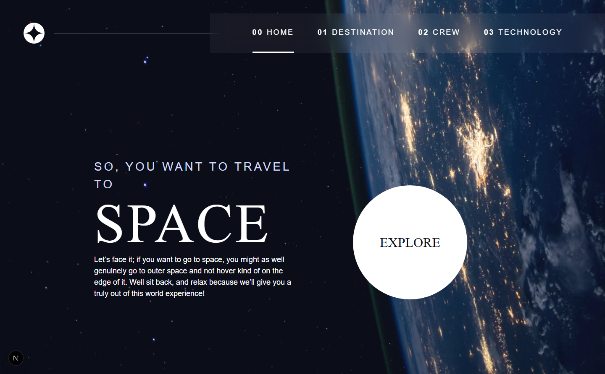
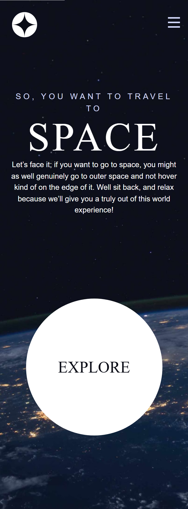

# Frontend Mentor - Space tourism website solution

This is a solution to the [Space tourism website challenge on Frontend Mentor](https://www.frontendmentor.io/challenges/space-tourism-multipage-website-gRWj1URZ3). Frontend Mentor challenges help you improve your coding skills by building realistic projects.

## Table of contents

-   [Overview](#overview)
    -   [The challenge](#the-challenge)
    -   [Screenshot](#screenshot)
    -   [Links](#links)
-   [My process](#my-process)
    -   [Built with](#built-with)
    -   [Useful resources](#useful-resources)
-   [Author](#author)

## Overview

### The challenge

Users should be able to:

-   View the optimal layout for each of the website's pages depending on their device's screen size
-   See hover states for all interactive elements on the page
-   View each page and be able to toggle between the tabs to see new information

### Screenshot

<table>
  <tr>
    <td></td>
    <td></td>
  </tr>
</table>

### Links

-   Solution URL: [Link](https://github.com/olaide-hok/space-tourism)
-   Live Site URL: [Link](https://space-tourism-coral-eight.vercel.app)

### Built with

-   Semantic HTML5 markup
-   CSS custom properties
-   Flexbox
-   CSS Grid
-   Mobile-first workflow
-   [React](https://reactjs.org/) - JS library
-   [Next.js](https://nextjs.org/) - React framework

### Useful resources

-   [Scrimba and Kevi Powell](https://scrimba.com/learn/spacetravel) - This helped me design systems. I really liked this pattern and will use it going forward.
-   [Next.js](https://nextjs.org/docs) - This is an amazing article which helped me in getting started with Next.js. I'd recommend it to anyone still learning this concept.

## Author

-   Website - [Habeeb Kareem](https://habeeb-dev.netlify.app)
-   Frontend Mentor - [@olaide-hok](https://www.frontendmentor.io/profile/olaide-hok)
